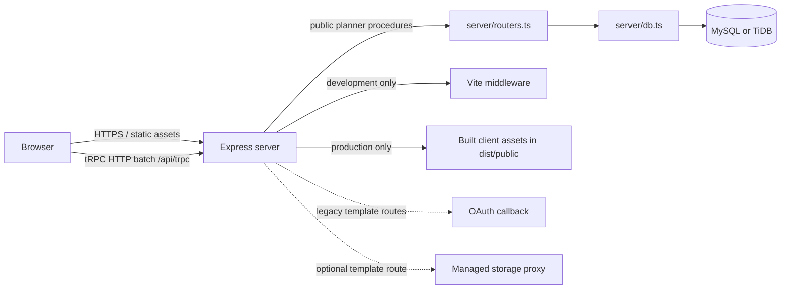

# Architecture

## Purpose and Scope

The application is a single shared wedding-planning workspace, not a multi-tenant SaaS product. It is optimized for two people managing one wedding and honeymoon plan. The user interface reads and writes planner settings, budget lines, and wedding-day events through a same-origin tRPC API.

## Runtime Topology

The server entry point is `server/_core/index.ts`. It creates one Express/HTTP process, registers JSON and URL-encoded parsers, mounts tRPC at `/api/trpc`, and chooses Vite middleware in development or static file serving in production. It reads `PORT` when present and otherwise starts from port `3000`.

## Major Components

| Component | Location | Responsibility |
|---|---|---|
| Planner dashboard | `client/src/pages/Home.tsx` | Renders all current planning sections, responsive layouts, local edit state, and mutation actions. |
| Client API binding | `client/src/lib/trpc.ts`, `client/src/main.tsx` | Connects React Query/tRPC to `/api/trpc` with SuperJSON. |
| Planner API | `server/routers.ts` | Validates planner inputs through Zod and exposes the public tRPC procedure surface. |
| Persistence layer | `server/db.ts` | Seeds default records, reads current state, updates settings and lines, resets plans, and manages timeline ordering. |
| Data schema | `drizzle/schema.ts` | Defines MySQL tables through Drizzle ORM. |
| Defaults and calculations | `shared/plannerDefaults.ts`, `shared/plannerCalculations.ts`, `shared/countdown.ts` | Holds starter records and pure, testable calculations. |
| Database migrations | `drizzle/*.sql` | Versioned DDL required to reproduce the schema in another environment. |

## Request and Data Flows

### Planner read flow

1. `Home.tsx` calls `planner.get` when the dashboard loads.
2. `server/routers.ts` invokes `getPlannerState()`.
3. `server/db.ts` creates the singleton settings record and default budget/timeline records if a table is empty.
4. The API returns settings, planner items, and timeline events.
5. The client calculates category rollups, variance, guest scenarios, and countdown presentation locally from the returned state.

### Planner write flow

1. A field edit or action invokes a typed tRPC mutation.
2. Zod validates the payload at the router boundary.
3. The database helper writes the targeted record or reorder operation.
4. The mutation invalidates `planner.get` in TanStack Query.
5. The dashboard reloads shared state and re-renders computed views.

### Timeline reordering flow

The timeline is ordered by an explicit integer `sortOrder`; display order is not derived from clock time. A move-up or move-down action swaps `sortOrder` values with the adjacent event. This is intentional because a run-of-show can include preparation tasks and reminders that are not strictly chronological.

## Current tRPC Surface

All planner methods are currently public procedures because the product was intentionally configured as a no-login shared-link planner.

| Procedure | Input | Effect |
|---|---|---|
| `planner.get` | None | Loads settings, budget items, and timeline events; seeds defaults if relevant tables are empty. |
| `planner.updateSettings` | Wedding date, guests, budgets, venue values | Updates the singleton planner settings record. |
| `planner.updateItem` | Item ID, planned cents, spent cents | Updates one wedding or honeymoon budget line. |
| `planner.restoreWedding` | None | Restores planned values and zeroes spend for all wedding budget lines. |
| `planner.restoreHoneymoon` | None | Restores planned values and zeroes spend for all honeymoon budget lines. |
| `planner.createTimelineEvent` | `eventTime`, `title`, `notes` | Adds a timeline event after the current last event. |
| `planner.updateTimelineEvent` | Event ID plus editable fields | Updates one timeline event. |
| `planner.deleteTimelineEvent` | Event ID | Deletes one timeline event. |
| `planner.moveTimelineEvent` | Event ID and direction | Swaps the selected event with its previous or next event. |

## Authentication and Template Coupling

The active planner functions do **not** require sign-in. The base template still contains Manus OAuth helpers, a user table, an OAuth callback route, and browser-side unauthorized-error redirect code. Those elements are inactive for the public planner procedures but remain platform coupling that a future owner should either configure or remove during migration. See [Environment guide](ENVIRONMENT.md) and [Security and limitations](SECURITY_AND_LIMITATIONS.md).

## Third-Party Connections

| Connection | Current use | Migration implication |
|---|---|---|
| Manus managed runtime | Hosts the current live deployment. | Replace with any Node-compatible host by building and starting the repository with recreated environment variables. |
| MySQL/TiDB database | Stores all live planner data. | Export/import the schema and data before retiring the current environment. |
| Cottonwood Barn website | Informational outbound link only. | No API key, webhook, or data synchronization. |
| Great Value Vacations and Vacation Express | Informational outbound links only. | No API key, affiliate integration, or data synchronization. |
| Manus OAuth and storage helpers | Residual template capabilities. | Not required for active planner features; remove or reconfigure if retained. |

## Design System

The interface uses a custom editorial dashboard treatment: burgundy, gold, and sage palette; Georgia serif headings; a scalable interlocking K/K monogram; and responsive card/table variants. Primary styles live in `client/src/index.css`; page composition is primarily in `client/src/pages/Home.tsx`.
